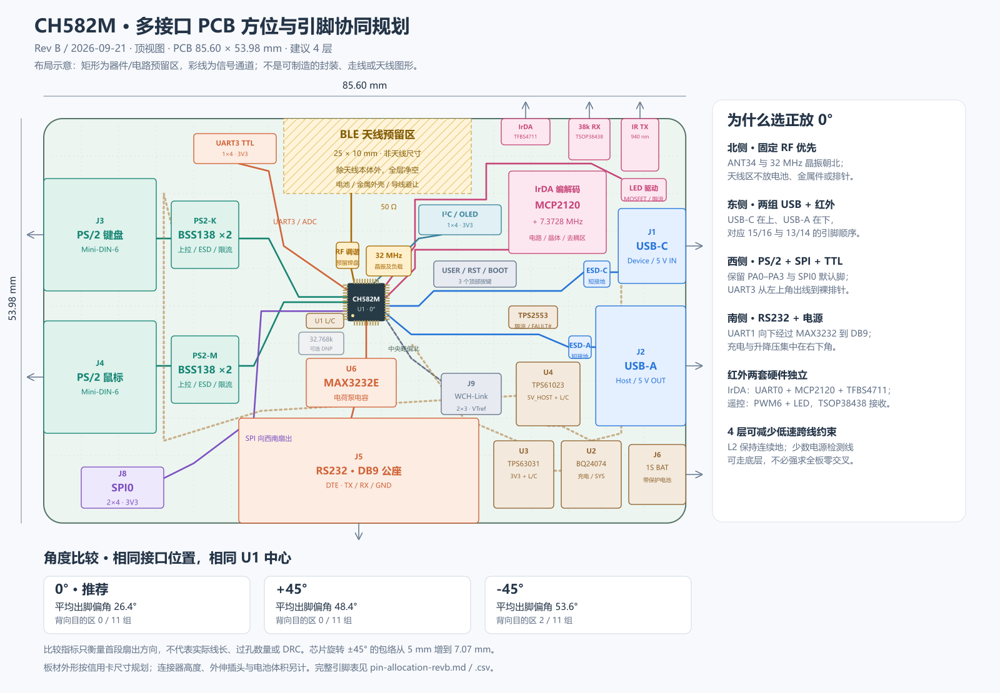

# 硬件设计文档索引

当前状态：云端原理图为待复核的 Rev A；本目录为 **Rev B 布局与引脚提案**。尚未创建已布线的 PCB 工程，也未将新增接口和引脚变更写入运行固件。

## 阅读顺序

1. [设计说明与资料来源](pcb-design-study.md)：接口方位、0°/±45° 比较、机械预算、电源与 RF 约束。
2. [布局 SVG](pcb-concept-revb.svg)：85.60 × 53.98 mm 顶视图；[PNG 预览](pcb-concept-revb.png)便于浏览。
3. [完整引脚表](pin-allocation-revb.md)：48 个引脚、EP、接插件脚序、复用约束和 Rev A 迁移清单。
4. [引脚方向 SVG](pinout-revb.svg) / [PNG](pinout-revb.png)：按照 CH582M 实际的上/下 10 脚、左/右 14 脚封装绘制。



## 文件用途

| 文件 | 用途 |
|---|---|
| [pin-allocation-revb.csv](pin-allocation-revb.csv) | 可导入表格工具的引脚分配，UTF-8 BOM |
| [placement-revb.json](placement-revb.json) | 预留区坐标与尺寸；毫米，原点左上，x 向右、y 向下 |
| [concept-checks.json](concept-checks.json) | 引脚完整性、预留区边界/重叠和扇出方向比较结果 |
| [generate_concept.py](generate_concept.py) | SVG、引脚表、坐标及检查结果的可复现生成脚本 |

预留区不等于精确 footprint/courtyard；信号通道线不等于铜线。角度比较不代表真实过孔数或线长，检查通过不等于 ERC/DRC、机械装配或 RF 验证通过。

## 修改与重新生成

引脚和位置数据以 `generate_concept.py` 中的 `PINS`、`PLACEMENTS`、`GROUPS` 为生成源。修改这些数据后，在仓库根目录运行：

```sh
python docs/hardware/generate_concept.py
```

脚本仅需 Python 3 标准库，会覆盖两张 SVG、Markdown/CSV 引脚表、坐标 JSON 和检查 JSON。`pcb-design-study.md` 是人工维护的说明；若更改布局或比较模型，需要同步更新其中的坐标、比较数值及取舍。

PNG 为 SVG 的浏览预览，脚本不会自动更新。使用 SVG 渲染器重新导出两张同名 PNG，并目视检查文字、连线与边界。已安装 Node.js 和 `sharp` 时，可从仓库根目录运行：

```sh
node -e "const sharp=require('sharp'); Promise.all(['pcb-concept-revb','pinout-revb'].map(n=>sharp('docs/hardware/'+n+'.svg').png().toFile('docs/hardware/'+n+'.png'))).catch(e=>{console.error(e);process.exitCode=1;})"
```

研究时下载的数据手册和临时渲染位于 `tmp/pcb-research/`，已忽略，不随仓库提交；制造商原始链接在设计说明的资料来源中保留。

## Rev A 记录及下一阶段

- [Rev A 引脚规划](../pin-plan.md)：保留历史值，包含 PB16 ADC 错误，不能直接沿用。
- [Rev A 设计取舍](../design-decisions.md)：历史原理图、电源及接口设计记录。
- [操作日志](../operation-log.md)：设计、整改和固件里程碑时间线。

进入实际 PCB 前：将 Rev B 提案逐项同步到原理图，锁定连接器/天线/电池及板厂层叠，复核电源预算与封装，然后运行 ERC 并建立真实 PCB 布局布线工程。
