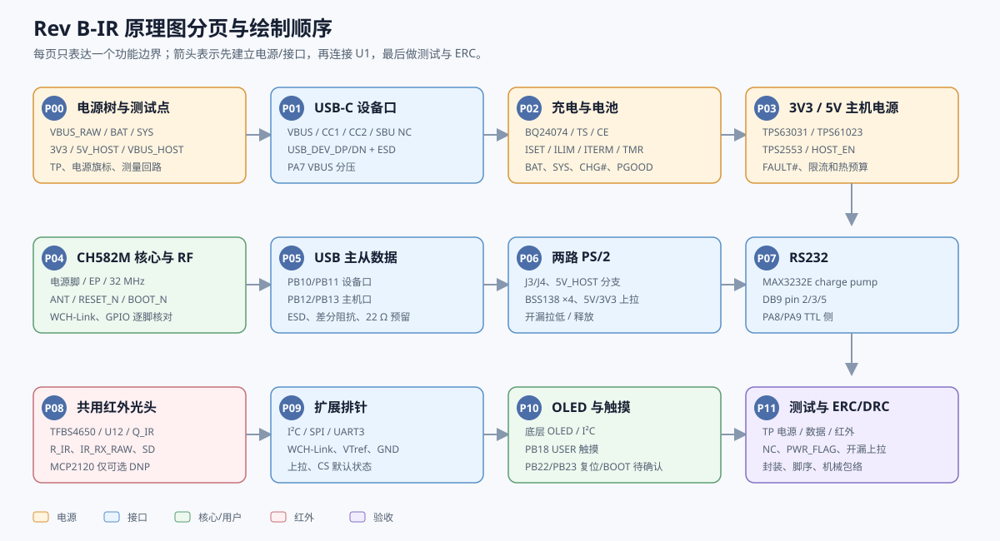
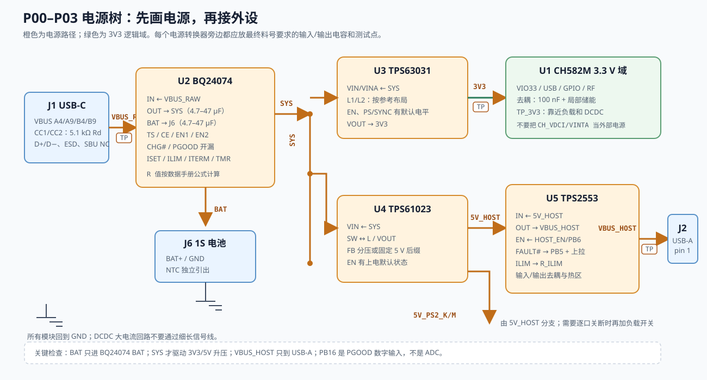
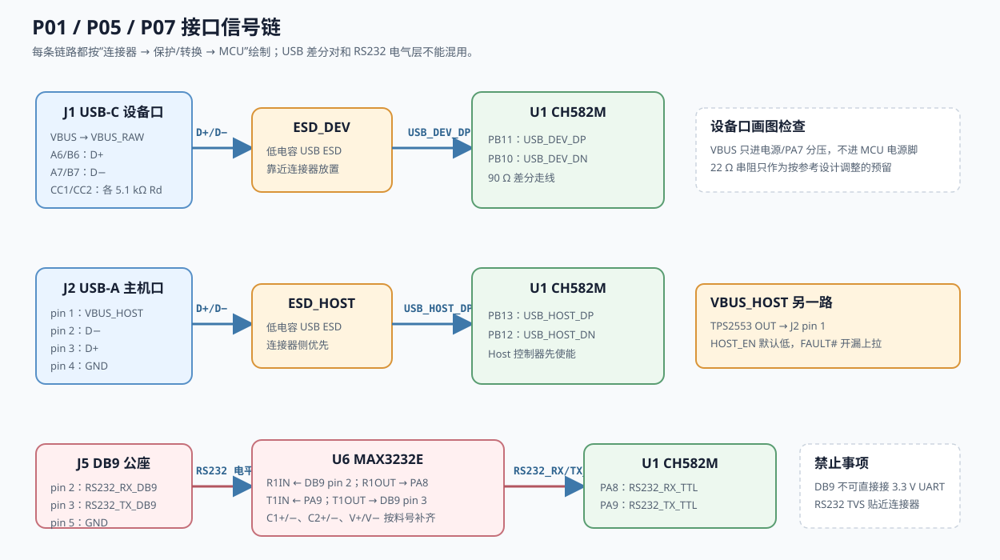
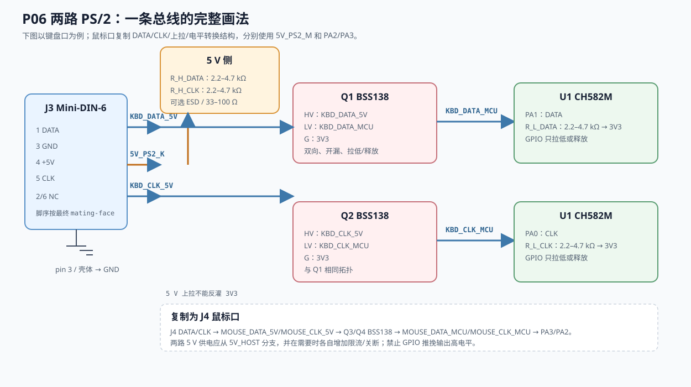
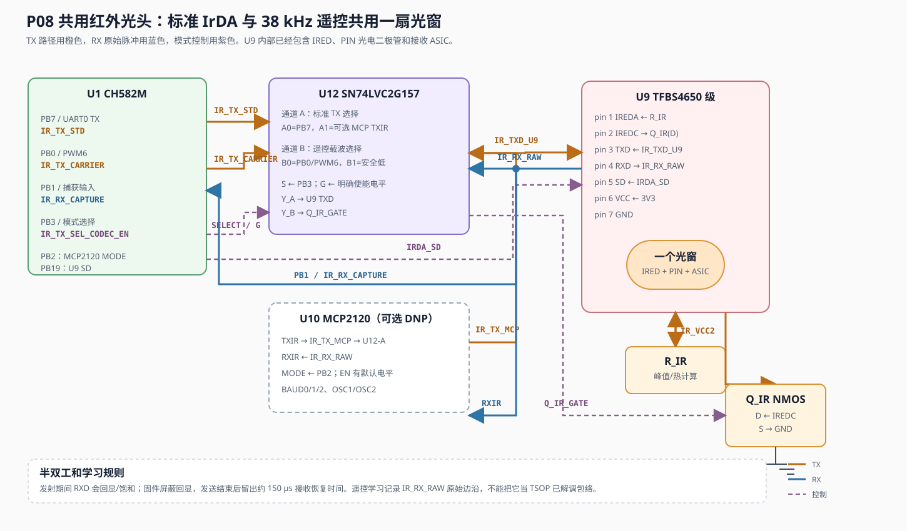
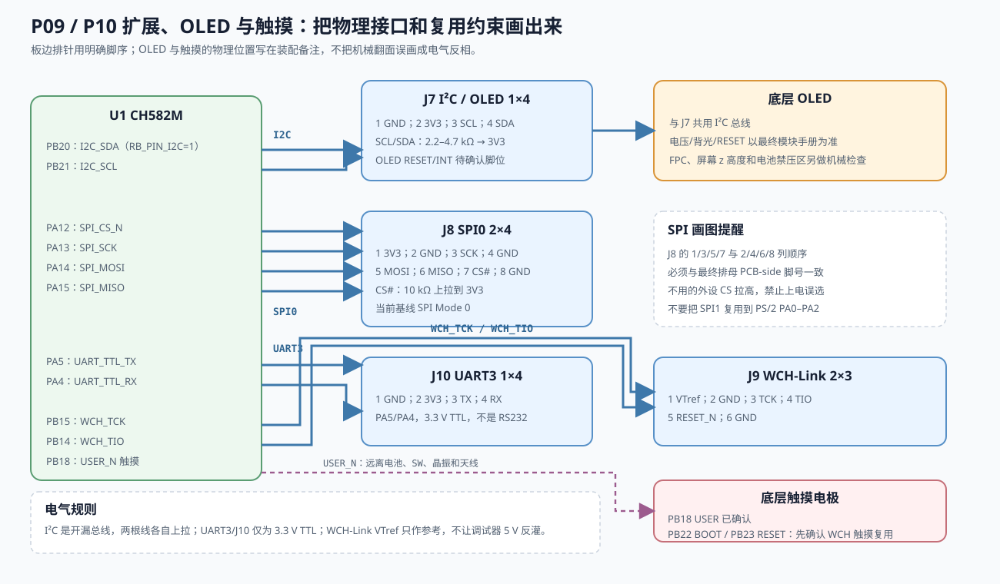

# Rev B / Rev B-M / Rev B-IR 原理图绘制指南

本文是把 `docs/hardware/pcb-design-study.md`、`pin-allocation-revb.md` 和已核对的器件资料落实成**可在嘉立创 EDA 中逐页绘制的原理图工作指令**。它针对当前的 CH582M 三模 HID Hub 提案，重点补齐每个外设模块的引脚、网络名、默认状态、保护件、测试点和 ERC 检查。

本文不是已经验收的制造网表。凡是写成“按最终料号确认”“按数据手册计算”“DNP/可选”的项目，必须在下单前用最终器件的数据手册、封装和电流预算复核。原理图中不要用“看起来相同”的库符号替代最终料号。

**2026-09-30 修订重点**：上一版把 U12 外部逻辑多路器误写成 IrDA/遥控的必需器件，也把 PB18 触摸写成普通上拉输入。本版撤销这两个结论：PB7/TXD0/PWM9 直接接 U9 TXD，由 CH582M 内部复用和固件在 UART0 与 PWM/定时器之间切换；触摸只走 WCH 触摸通道，和红外没有硬件复用关系。U12 不进入基线 BOM。

**2026-09-30 电源评估结论**：IP5305T + AMS1117 可以组成充电宝式的 5 V/3.3 V 原型，但不满足本板正式电源树的低负载常供电、USB-A 逐口限流和 BQ24074 状态脚需求。本指南的正式基线仍是 `BQ24074 → SYS → TPS63031/TPS61023 → TPS2553`；候选方案的计算、原型接法和晋级条件见 [IP5305T + AMS1117 电源方案评估](power-management-evaluation.md)。不要把候选图中的 `5V_IP5` 直接改名为 `SYS`。

## 0. 先冻结哪些设计决定

在 EDA 中放置第一个符号前，先在项目标题栏写明 `Rev B-IR / Schematic Draft`，并把下列决定记录为设计参数：

| 项目 | 本指南基线 | 画图时的处理 |
|---|---|---|
| MCU | CH582M，QFN48，3.3 V I/O | 以 WCH 官方参考原理图和最终封装 pin number 为准；不要只按 GPIO 名称猜脚号 |
| 红外 | 一个带 IREDC 引出的 TFBS4650 级共用光头 | U9 同时负责 IrDA 和遥控收发；不再并列放 TSOP 或独立 IrDA LED |
| 遥控发射 | **U9 TXD 直接由 PB7/TXD0/PWM9 驱动** | 同一根线在软件中输出 UART/SIR 或 38 kHz 载波+包络；IREDC/Q_IR/R_IR 只保留为实测不足时的 DNP 增强支路 |
| IrDA 编码 | MCU 软件 UART/定时器为主 | MCP2120 仅作为 DNP 可选物理层编码器，不能把它当协议栈；不放运行时外部 TX 多路器 |
| 电源架构 | `VBUS_RAW → BQ24074 → SYS → TPS63031/TPS61023 → TPS2553` | IP5305T + AMS1117 仅为未批准的原型分支；正式原理图不要删除 power-path、5 V 升压或 USB-A 限流开关 |
| 电池 | 1S 受保护锂电池，中央盆地 | J6 只定义 BAT+/GND；NTC 独立焊盘或随电池连接器引出，极性必须在丝印和原理图同时标明 |
| 机械 | CH582M 顶层面向盆地，OLED/触摸在底层面向用户 | 原理图不表达上下翻转；在装配备注中写明顶层器件高度、光窗、天线和电池禁压区 |
| 接口 | USB-C 设备、USB-A 主机、DB9 公座、两路 Mini-DIN-6 PS/2、板边直角排母 | 连接器的 mating-face/PCB-side 脚序必须用最终 3D 模型复核 |

如果最终选用不带 IREDC 的 TFBS4711，删除 IREDC/Q_IR/R_IR 的可选支路即可；PB7 直接 TXD 的标准 IrDA 与遥控复用仍需按该器件的 TXD 脉宽、峰值电流和光学指标实测，不能只替换封装而宣称遥控性能不变。

## 1. 页面分区和绘图顺序

采用多页原理图，每页只表达一个功能边界。页面之间只用全局网络标签或层次端口连接，避免跨页长线。

1. **P00 电源树与测试点**：`VBUS_RAW`、充电 power-path、`BAT`、`SYS`、`3V3`、`5V_HOST`、`VBUS_HOST`。
2. **P01 USB-C 设备口**：VBUS、CC、D+/D−、ESD、VBUS 分压。
3. **P02 充电与电池**：BQ24074、NTC、CHG#/PGOOD、ISET/ILIM/ITERM/TMR、J6。
4. **P03 3.3 V 与 5 V 主机电源**：TPS63031、TPS61023、TPS2553、HOST_EN/FAULT#。
5. **P04 CH582M 核心与 RF**：U1、电源脚、EP、32 MHz 晶振、ANT、RESET_N、BOOT_N、WCH-Link。
6. **P05 USB 主从数据**：U1 USB Device/Host 引脚、USB ESD、差分对标签。
7. **P06 两路 PS/2**：J3/J4、5 V 受控供电、四颗 BSS138、5 V/3.3 V 上拉。
8. **P07 RS232**：MAX3232E、DB9、charge-pump 电容、TTL 侧 UART1。
9. **P08 共用红外光头**：U9、PB7/PB4 直连、RXD 可选 PB1 捕获、可选 DNP IREDC/Q_IR/R_IR 和 U10 MCP2120。
10. **P09 I²C/SPI/UART3/WCH-Link 扩展**：J7–J10、上拉、CS 默认状态、VTref。
11. **P10 OLED 与触摸**：底层 OLED/FPC 接口、PB18 USER、待确认的 RST/BOOT 触摸电极。
12. **P11 ERC/测试点清单**：所有外部接口、未用引脚、测量点和装配备注。

推荐每页从左到右按“连接器/电源入口 → 保护/转换 → MCU 侧”排布；电源从上到下，地符号统一朝下。不要用文字重叠来代替网络连接，也不要把一个网络的多个功能塞进同一个隐藏端口。



图 1：先按功能页建立边界，再在每页内完成“入口 → 保护/转换 → MCU”的连接。图中的页号与本指南后续章节一致。

## 2. 网络命名和全局规则

建议直接使用以下网络名。名称一旦进入原理图和 PCB，不要在不同页面改写大小写或后缀。

| 类别 | 网络名 |
|---|---|
| 电源 | `VBUS_RAW`, `BAT`, `SYS`, `3V3`, `5V_HOST`, `VBUS_HOST`, `5V_PS2_K`, `5V_PS2_M`, `GND` |
| USB | `USB_DEV_DP_MCU`, `USB_DEV_DN_MCU`, `USB_HOST_DP_MCU`, `USB_HOST_DN_MCU`, `USB_C_VBUS_ADC` |
| RS232 | `RS232_RX_TTL`, `RS232_TX_TTL`, `RS232_RX_DB9`, `RS232_TX_DB9` |
| PS/2 | `KBD_CLK_5V`, `KBD_DATA_5V`, `KBD_CLK_MCU`, `KBD_DATA_MCU`, `MOUSE_CLK_5V`, `MOUSE_DATA_5V`, `MOUSE_CLK_MCU`, `MOUSE_DATA_MCU` |
| 红外 | `IR_TXD_U9`, `IR_RX_RAW`, `IR_TX_MCP`（可选）, `IRDA_SD`, `IR_VCC2`, `IR_EXT_SINK_GATE`（可选） |
| 扩展 | `I2C_SCL`, `I2C_SDA`, `SPI_SCK`, `SPI_MOSI`, `SPI_MISO`, `SPI_CS_N`, `UART_TTL_TX`, `UART_TTL_RX`, `WCH_TCK`, `WCH_TIO`, `RESET_N`, `BOOT_N` |
| 状态/采样 | `CHG_N`, `INPUT_PGOOD_N`, `HOST_EN`, `HOST_FAULT_N`, `VBAT_SENSE`, `USB_C_VBUS_ADC` |

必须遵守以下规则：

- 所有电源脚都显式放置 `3V3`、`SYS` 或 `GND` power symbol；不要依赖隐藏电源脚名称。
- `VBUS_RAW` 只能表示 USB-C 进入板子的 5 V；`VBUS_HOST` 只能表示经过 TPS2553 后给 USB-A 的受控 5 V；两者不能用同一个标签。
- 开漏状态脚 `CHG_N`、`INPUT_PGOOD_N`、`HOST_FAULT_N` 各自使用独立的 4.7–10 kΩ 上拉到 3V3，不能把开漏输出直接接到 MCU 推挽输出。
- 每个连接器的 NC 脚都放 `No Connect` 标记；不能用“没画线”表示 NC。
- 同名标签表示同一物理网络。不同电压域即使信号逻辑相似，也要加 `_5V`、`_MCU` 或 `_HOST` 后缀。
- `IR_TXD_U9` 只有一个基线推挽驱动：U1 PB7。标准 IrDA 和遥控不是两根并联线，而是 PB7 的 UART0/PWM9 内部功能切换；若装 MCP2120，必须用装配时 0 Ω 选择 TX 源，不能把两个推挽输出硬并联。

## 3. U1 CH582M 核心页

### 3.1 按引脚表放置网络

以 `pin-allocation-revb.md` 为唯一 GPIO 分配表，放置后逐脚打勾。核心信号如下：

| U1 引脚/功能 | 网络 | 绘图要求 |
|---|---|---|
| VIO33/VDD33 | `3V3` | 每个电源脚旁放 100 nF；再放 1–4.7 µF 的局部储能 |
| VDCID/VDCIA/VINTA/VSW | `CH_VDCI`、`CH_VINTA`、`CH_VSW` | 按 WCH 参考图决定 DCDC/LDO 连接、电感和去耦；内部节点不得引出到外部接口 |
| X32MO/X32MI | `X32MO`、`X32MI` | 32 MHz 晶体紧贴 U1；负载电容按晶体 CL、封装寄生和走线计算，不要机械套用 12 pF |
| ANT | `RF_ANT` | 50 Ω 走线、匹配焊盘和天线 keep-out；电池、螺丝、墙体和铜皮不得进入净空 |
| PA8/PA9 | `RS232_RX_TTL`/`RS232_TX_TTL` | 只连接 MAX3232E TTL 侧，不连接 DB9 |
| PB10/PB11 | `USB_DEV_DN_MCU`/`USB_DEV_DP_MCU` | 仅到 USB-C 设备差分对 |
| PB12/PB13 | `USB_HOST_DN_MCU`/`USB_HOST_DP_MCU` | 仅到 USB-A 主机差分对 |
| PA0–PA3 | PS/2 MCU 侧 | 经四颗 BSS138；软件只能开漏拉低或释放 |
| PA4/PA5 | `UART_TTL_RX`/`UART_TTL_TX` | UART3 板边排母，3.3 V TTL |
| PA6/PA7 | `VBAT_SENSE`/`USB_C_VBUS_ADC` | 通过分压和 RC 接入 ADC；计算最大输入电压，禁止 5 V 直连 |
| PA12–PA15 | SPI0 | `CS/SCK/MOSI/MISO`，按 pin 表连接 J8 |
| PB18 | `USER_TOUCH` | 当前确认的 USER 电容触摸通道；按 WCH touch 配置使用，不默认放 GPIO 上拉 |
| PB19 | `IRDA_SD` | U9 SD，高电平关断；放约 10 kΩ 下拉到 GND，PB19 拉高才关断 |
| PB20/PB21 | `I2C_SDA`/`I2C_SCL` | I²C 重映射必须在固件设置 `RB_PIN_I2C=1` |
| PB22/PB23 | `BOOT_N`/`RESET_N` | 调试/ISP 保留脚；只有确认 WCH 触摸复用后才允许画为触摸电极 |
| PB0/PB1/PB2/PB3/PB4/PB6/PB7 | 红外/主机/IrDA | PB7/PB4 为 U9 直连；PB1 仅作可选高阻捕获，PB0 只作可选 IREDC/Q_IR 栅极，PB2/PB3 不接外部红外选择器 |
| PB5/PB8/PB9/PB14/PB15/PB16/PB17 | 状态/调试/充电 | PB16 是数字 `INPUT_PGOOD_N`，不是 ADC |
| EP | `GND` | 大面积地铜和多个过孔；核对库中 EP 是 pin 0 还是 pin 49 |

### 3.2 复位、BOOT 和调试

- `RESET_N` 使用外部上拉到 3V3，并预留复位电容/按键焊盘；数值按 WCH 参考图和实际上电波形确认。
- `BOOT_N` 使用明确的默认电平和 WCH-Link 连接；不要让 OLED、触摸或外部排针在断电时把它拉到不确定电平。
- J9 WCH-Link 只引出 VTref、GND、TCK、TIO、RESET_N；VTref 用于电平参考，不与调试器 5 V 电源硬并联。
- WCH-Link、USB-C ISP 和用户触摸的复位路径要在原理图上分开标注，便于查找“无法下载”是电平、复位还是电源问题。

## 4. 电源页：从 USB-C 到各电压域

### 4.1 USB-C 入口

J1 所有 VBUS 引脚并到 `VBUS_RAW`，所有 GND 引脚和屏蔽层按最终 ESD 方案处理。CC1、CC2 各放 5.1 kΩ Rd 到 GND，SBU 保持 NC。VBUS 入口依次放保险丝/限流件（若最终方案需要）、TVS 和输入电容，再进入 U2 BQ24074 的 IN。USB-C 的 5 V 不能直接接 U1 或 3V3。

`USB_C_VBUS_ADC` 由 `VBUS_RAW` 分压得到，分压上端电阻必须按 PA7 的 ADC 最大输入和功耗计算，下端接 GND，分压中点放 1–10 nF RC；在 MCU 采样前关闭不需要的数字上拉。



图 2：电源树的原理图级连接关系。`SYS` 是 power-path 系统电源，`BAT` 是电芯端，`5V_HOST` 同时服务 PS/2 和 USB-A 限流开关。

### 4.2 U2 BQ24074 充电和 power-path

按最终料号符号逐脚连接，不要只画一个“充电器方框”：

| BQ24074 引脚 | 连接 | 要求 |
|---|---|---|
| IN | `VBUS_RAW` | 旁边放数据手册要求的输入电容；走线先到 IN，再分支其他负载 |
| OUT | `SYS` | 放 4.7–47 µF 及 100 nF；这是系统电源路径，不是裸电池端 |
| BAT | `BAT`/J6 BAT+ | 放 4.7–47 µF；电池必须有保护，极性在 J6 丝印标明 |
| VSS | `GND` | 低阻回地，避免与大电流 USB-A 回路共用细长线 |
| CE | `CHARGE_CE_N` 或固定有效电平 | BQ24074 为低电平允许充电、高电平禁用充电；若由 MCU 控制，必须有上电默认状态 |
| EN1/EN2 | `CHG_EN1`/`CHG_EN2` | PB8/PB17；不要悬空，外部下拉让上电默认模式可预测 |
| CHG | `CHG_N` | 开漏，4.7–10 kΩ 上拉到 3V3；接 PB9 |
| PGOOD | `INPUT_PGOOD_N` | 开漏，4.7–10 kΩ 上拉到 3V3；接 PB16 |
| TS | `BAT_NTC` | 接电池 NTC 或按数据手册禁用方案；不能任意接地后宣称温度保护有效 |
| ISET | `R_ISET` 到 GND | 按目标充电电流和最终料号公式计算，原理图标出计算值与容差 |
| ILIM | `R_ILIM` 到 GND | 设定输入限流；不要把 ILIM 当逻辑输入直接驱动 |
| ITERM | `R_ITERM` 到 GND | 设定终止电流；不使用时按数据手册处理，不能悬空 |
| TMR | `R_TMR`/禁用方案 | 按充电超时策略填写；不要留下未解释的 NC |

按 BQ24074 数据手册的典型常数先做一版计算，再用最终料号的电气特性复核：

```text
R_ISET  = 890 A·Ω / I_CHG
R_ILIM  = 1550 A·Ω / I_IN_MAX
R_ITERM = I_TERM × R_ISET / 0.030     (EN1/EN2 非 USB100 模式)
R_ITERM = I_TERM × R_ISET / 0.010     (EN1 = EN2 = 0 的 USB100 模式)
R_TMR   = t_MAXCHG / (10 × 48 s/kΩ)
```

电流用 A、电阻用 Ω（或在同一公式中统一用 kΩ），再从 E96 选取 1% 电阻并把实际值写回原理图备注。`I_IN_MAX` 包含系统负载和充电电流；若选择 USB100，终止电流阈值也会变化。`CE`、`EN1`、`EN2` 不得悬空。

在 P02 旁边写设计备注：`BAT 为电芯端，SYS 为 power-path 输出；禁止 BAT 直接驱动 3V3/5V 升压`。这样可以避免把旧 Rev A 的 BAT/SYS 误接重新带入 Rev B。

### 4.3 3V3：TPS63031

U3 以 SYS 为输入的 buck-boost 3.3 V 固定输出为基线。按最终封装连接 `VIN`、`VINA`、`EN`、`PS/SYNC`、`L1/L2`、`VOUT`、`GND/PGND` 和散热焊盘；典型起点是 1.5 µH 电感、输入 10 µF、输出 2×10 µF 加 100 nF，最后以数据手册和负载瞬态校核。固定 3.3 V 版本通常不需要 FB 分压，但仍要确认最终后缀。

`EN` 和 `PS/SYNC` 必须有明确的上电状态。若 3V3 需要系统始终工作，可按数据手册上拉；若由 MCU 关闭，增加 `3V3_EN` 并放外部默认电阻。DCDC 的 SW 节点只连接电感和芯片指定引脚，不要把它当作可用电源测试点。

### 4.4 5V_HOST：TPS61023 与 TPS2553

U4 TPS61023 从 `SYS` 产生 `5V_HOST`。画出 VIN、SW、VOUT、FB、EN、GND，电感放在 VIN/SW 规定位置，按最坏 `SYS`、5 V 输出和负载计算电感饱和电流。不要把开关峰值电流直接当作 USB 输出电流。若使用可调后缀，必须画 FB 分压；固定 5 V 后缀则按其真值表处理。当前基线中 `5V_HOST` 同时作为 PS/2 的 5 V 来源和 U5 的输入；`5V_PS2_K/M` 是从它分出的两个端口网络，若后续需要逐口关断，再在分支处增加独立负载开关。

U5 TPS2553 是 USB-A VBUS 的受控限流开关：

| U5 | 网络/器件 | 画图要求 |
|---|---|---|
| IN | `5V_HOST` | 输入旁放去耦；不要接到未经升压的 `SYS` |
| OUT | `VBUS_HOST` | 接 J2 pin 1，并在连接器附近放输出电容/ESD |
| EN | `HOST_EN`/PB6 | 放外部下拉，上电默认关闭；是否与 boost EN 共用要在设计备注中写清 |
| FAULT | `HOST_FAULT_N`/PB5 | 开漏，4.7–10 kΩ 上拉到 3V3；这是故障指示，不是电压测量 |
| ILIM | `R_ILIM` | 按最终料号公式和 USB-A 目标电流选值；原理图写明目标电流 |
| GND | `GND` | 与 USB-A 回流和散热铜区短而宽 |

### 4.5 IP5305T + AMS1117 候选方案（不进入正式基线）

本节专门记录本次评估，防止在嘉立创 EDA 中把一个“充电宝电源芯片 + LDO”误当成当前整板的等价替换。正式电源页仍按 4.1–4.4 绘制；候选原型的图示见 [power-candidate-ip5305t.svg](schematic-guide/power-candidate-ip5305t.svg)，完整计算见 [IP5305T + AMS1117 电源方案评估](power-management-evaluation.md)。

IP5305T 的 ESOP8 只有 `VIN`、`LED1/VSET`、`LED2/VTHS`、`LED3`、`KEY`、`BAT`、`SW`、`VOUT` 和接地裸焊盘。它没有 `CHG#`、`PGOOD#`、`CE`、`EN1/EN2` 或电池 `TS` 引脚，因此不能把旧图中的 `CHG_N`、`INPUT_PGOOD_N`、`CHG_EN1`、`CHG_EN2` 直接移植到某个 LED/KEY 脚。需要这些状态时，必须另加监测器并重写电源状态机。

若只做独立原型，按以下网络名绘制，**不要使用 `SYS`**：

| 候选网络 | 连接 | 原理图要求 |
|---|---|---|
| `IP5_VIN` | USB-C VBUS 经入口保护后到 IP5305T VIN | CC1/CC2 各 5.1 kΩ Rd；输入电容贴近 VIN；不宣称 USB PD |
| `BAT` | IP5305T BAT 到 1S 受保护电池 | 按电芯选择 `VSET/LED1`；电池极性、NTC 和保护板单独标注 |
| `5V_IP5` | IP5305T VOUT | 2.2 µH SW 回路、输入/输出储能和测试点按原厂典型应用；这是单路 5 V 总线 |
| `3V3` | `5V_IP5 → AMS1117-3.3` | 近端输入/输出电容和散热铜区；按 `P=(5−3.3)×I3V3` 计算温升 |
| `VBUS_HOST` | `5V_IP5 → TPS2553 → USB-A` | 仍保留 `HOST_EN`、`HOST_FAULT_N` 和逐口限流；不能把 VOUT 直接接 USB-A |
| `5V_PS2_K/M` | 从受控 5 V 分支 | 和 USB-A 共同计入 IP5305T 的 1 A 总预算，必要时逐口加开关 |

IP5305T 数据表还规定：VOUT 负载持续低于约 45 mA 时会在约 32 s 后进入轻载关机。BLE/OLED/触摸待机若低于此阈值，5 V 和 AMS1117 的 3V3 会被切断；靠约 100 Ω 保持负载会长期浪费约 50 mA。当前产品需要电池状态下持续待机，所以该候选不通过正式设计评审。

在正式原理图中，P00–P03 仍保留 `VBUS_RAW`、`BAT`、`SYS`、`3V3`、`5V_HOST`、`VBUS_HOST` 和 `CHG_N/INPUT_PGOOD_N` 的现有定义；只有当候选方案完成低负载、输入插拔、满载、温升和电源状态机测试后，才另开 `Rev B-P` 重新编号和审查。

## 5. USB 设备和主机

### 5.1 USB-C 设备口

- J1 A6/B6 并到 `USB_DEV_DP_MCU`，A7/B7 并到 `USB_DEV_DN_MCU`；先在符号属性中确认 A/B 面脚号。
- D+/D− 旁放低电容 USB ESD，ESD 到连接器侧，差分对再进入 U1 PB11/PB10。
- 两线按 90 Ω 差分阻抗布线；22 Ω 串联电阻是否需要按 WCH 参考设计和眼图决定，原理图用 `R_USB_DEV_DP/DN` 标注可调整，不要无依据固定。
- VBUS 检测只进 PA7 分压；USB 设备数据线不接 `VBUS_HOST`。

### 5.2 USB-A 主机口

- J2 pin 2/3 分别接 `USB_HOST_DN_MCU`/`USB_HOST_DP_MCU`，在连接器处放 USB ESD。
- J2 pin 1 只接 `VBUS_HOST`；J2 pin 4 接 GND；壳体按屏蔽方案接地。
- `HOST_EN` 默认低，先开 TPS2553，再允许 USB Host 控制器枚举；`HOST_FAULT_N` 进入 PB5。
- USB-A 5 V 电流预算必须同时满足 TPS61023、TPS2553 热、USB 负载和电池 power-path；在 P03 放“最大连续电流/峰值电流”备注。



图 3：USB-C 设备口、USB-A 主机口和 DB9/RS232 三条独立链路。USB 差分线经过低电容 ESD；DB9 只连接 MAX3232E 的 RS232 侧。

## 6. 两路 PS/2

每个 Mini-DIN-6 都使用同一拓扑，不能只复制连接器而漏掉独立供电和电平转换：

| J3/J4 针脚 | 网络 | 备注 |
|---:|---|---|
| 1 | `*_DATA_5V` | 按最终 Mini-DIN-6 mating-face/PCB-side 图确认 |
| 2 | NC | 放 No Connect |
| 3 | GND | 低阻回路 |
| 4 | `5V_PS2_K` 或 `5V_PS2_M` | 从 `5V_HOST` 分支；若要独立关断/限流，在此处增加负载开关或保险 |
| 5 | `*_CLK_5V` | 开漏总线 |
| 6 | NC | 放 No Connect |

每路信号使用两颗 BSS138：MCU 侧接 3V3，上拉 2.2–4.7 kΩ；PS/2 侧接 5 V，上拉 2.2–4.7 kΩ。MOS 栅极接 3V3，源漏按双向开漏电平转换参考拓扑连接。MCU PA0/PA1 为键盘 CLK/DATA，PA2/PA3 为鼠标 CLK/DATA。

PS/2 信号只能“拉低或释放”，禁止 CH582M GPIO 推挽输出高电平。每根线可预留 33–100 Ω 串联电阻和连接器侧 ESD；不要在 5 V 总线掉电时让外部上拉通过 BSS138 反向给 3V3 供电。正式画图时用两个独立的 `5V_PS2_*` 电源标签，方便后续分别限流或关断。



图 4：键盘口的一条完整 DATA/CLK 电平转换示意；鼠标口复制相同拓扑并替换网络名和 MCU 引脚。

## 7. RS232：MAX3232E 和 DB9

J5 采用 DB9 公座 DTE 定义：pin 2 为 RX，pin 3 为 TX，pin 5 为 GND；其余握手脚先放 NC，除非需求另有变更。

U6 MAX3232E 按最终料号逐脚连接：

| MAX3232E | 连接 |
|---|---|
| VCC | `3V3`，旁边 100 nF |
| GND | `GND` |
| C1+/C1−、C2+/C2− | 四颗 charge-pump 电容，数值/耐压按最终数据手册 |
| V+/V− | 电荷泵电容到地，禁止接外部电源 |
| T1IN | `RS232_TX_TTL`，U1 PA9 |
| T1OUT | `RS232_TX_DB9`，J5 pin 3 |
| R1IN | `RS232_RX_DB9`，J5 pin 2 |
| R1OUT | `RS232_RX_TTL`，U1 PA8 |

DB9 侧可放低电容 RS232 TVS，器件尽量靠近连接器。DB9 引脚绝不能直接接 CH582M 3.3 V UART；只有 MAX3232E 的 TTL 侧能接 U1。

## 8. 共用红外光头（P08）

### 8.1 U9 TFBS4650 级模块

按侧视 7 针器件的最终封装核对 pin 1 方向：

| U9 pin | 名称 | 网络/连接 |
|---:|---|---|
| 1 | IREDA | `IR_VCC2`；是否串 R_IR 以最终 TFBS4650 电流/应用电路为准 |
| 2 | IREDC | 基线 NC/测试点；仅在可选 DNP Q_IR 支路装配时接 Q_IR 漏极 |
| 3 | TXD | `IR_TXD_U9`，**直接来自 U1 PB7/TXD0/PWM9** |
| 4 | RXD | `IR_RX_RAW`，直接到 PB4/RXD0；可选高阻/0 Ω 分支到 PB1 捕获 |
| 5 | SD | `IRDA_SD`/PB19；高电平关断，约 10 kΩ 下拉到 GND |
| 6 | VCC | `3V3`，紧贴放去耦 |
| 7 | GND | `GND`，就近回流 |

TFBS4650 内部已有 IRED、PIN 光电二极管和接收 ASIC。U9 RXD 是共用接收原始脉冲节点，不是 TSOP 那种已解调的 38 kHz 包络；因此遥控学习必须在 MCU 中记录脉宽/边沿，再恢复协议。



图 5：PB7 直接连接 U9 TXD；UART0 与 PWM9 是 MCU 内部功能选择。U9 RXD 直接到 PB4，并可高阻分支到 PB1。IREDC/Q_IR/R_IR 和 MCP2120 都是可选 DNP 支路，不是基线必装器件。

### 8.2 标准 IrDA 与家电遥控的同脚复用

基线只画一条 TX 物理网络：

```text
U1 PB7/TXD0/PWM9 ─────────────────────────────── U9 TXD
       ├─ 标准 IrDA：UART0 TX，输出 SIR 脉冲
       └─ 家电遥控：PWM9/定时器，输出 38 kHz 载波 + NEC/RC5 包络

U9 RXD ── IR_RX_RAW ──┬─ U1 PB4/RXD0（标准接收）
                       └─ 0 Ω/串阻可选 ── U1 PB1（学习捕获）
```

这不是“同时全双工”：同一颗光头仍按半双工物理层工作，发射期间 RXD 可能回显或饱和；固件要屏蔽回显，并在发送结束后按数据手册留出恢复时间。它也不需要把触摸信号接入任何红外选择器。

常见 38 kHz 遥控载波的高电平约为 8.8 µs（1/3 占空比）到 13.2 µs（50% 占空比）；TFBS4650 数据手册给出的 TXD 输入脉宽窗口覆盖这一范围，但光强、距离和不同协议的长包络仍要用实物验证。

### 8.3 可选 IREDC/Q_IR 增强支路

只有在直接 TXD 的光强、脉宽或外部发光器需求实测不足时，才装配下面的 DNP 支路：

```text
IR_VCC2 ── R_IR（按脉冲电流/热计算）── U9 IREDA / 内部 IRED ── U9 IREDC ── Q_IR(D)
PB0/PWM6 ── 22–100 Ω ── Q_IR(G)，Q_IR(G) 到 GND 放 47–200 kΩ 下拉
Q_IR(S) ── GND
```

该支路不是第二个光学器件，也不是外部 TX 多路器。装配后，标准 IrDA 使用 PB7/TXD0 且 PB0/Q_IR 保持关闭；遥控增强模式由固件先把 PB7/TXD0 置于安全低电平，再用 PB0/PWM6 控制 Q_IR。`R_IR` 按 `VCC2 - V_F(IRED) - V_DS(on)`、峰值电流、载波/包络占空比和脉冲功率计算。若改用外部 940 nm IRED，必须重新验证 IREDC、光窗、热和眼安全；TFBS4650 内置 IRED 约为 870–910 nm。

### 8.4 可选 U10 MCP2120

如果装配 MCP2120，按数据手册原始引脚号画，不要按旧库符号猜：`VDD` 接 3V3，`VSS` 接 GND，`OSC1/OSC2` 接最终晶振，`RESET` 有明确默认状态，`RXIR` 接 `IR_RX_RAW`，`TXIR` 输出 `IR_TX_MCP`，`MODE` 接固定默认电平或通过 DNP 0 Ω 接预留 GPIO，`EN` 有上拉/下拉，`BAUD0/1/2` 固定到所需模式，`RX/TX` 若不使用则明确 NC 或测试点。PB2 不再作为基线 MODE 专用脚。7.3728 MHz 晶体只是常见起点，必须按目标波特率和最终数据手册确认。

U10 只作为装配时的物理层编码选项，不是 MCU 解码或遥控发射的前置条件。基线不装 U10 时，`IR_TXD_U9` 由 PB7 直驱；若装 U10，用 `R_TX_MCU`/`R_TX_MCP` 两个互斥的 0 Ω 位号选择 TX 源，不能把 PB7 和 `TXIR` 两个推挽输出并在一起。`IR_RX_RAW` 到 U10 `RXIR` 必须保持高阻输入关系。

### 8.5 接收和半双工约束

- `IR_RX_RAW` 只允许接收输入；PB4 是标准 UART0 接收，PB1 是可选边沿捕获，U10 RXIR 为可选高阻输入。
- 发射期间 RXD 可能回显 TXD 或因接收器饱和，固件必须屏蔽回显，并在发送结束后按数据手册留出至少约 150 µs 的接收恢复时间。
- 标准 IrDA SIR 3/16 编码可由 MCU 定时器/UART 软件生成；MCP2120 只是编码器选项，不是必需外设。
- P08 放 `TP_IR_RX_RAW`、`TP_IR_TXD_U9` 两个基线测试点；`TP_IR_EXT_SINK_GATE` 只在 Q_IR DNP 位号实际装配时增加。

## 9. I²C、SPI、UART3 和 WCH-Link 排针

### 9.1 I²C / OLED（J7）

PB20=`I2C_SDA`、PB21=`I2C_SCL`，网络名标注 `RB_PIN_I2C=1`。I²C 是开漏/线与总线，**每根线必须在总线某处有上拉**；CH582M 的 GPIO 内部上拉只能作为短线、低速实验的后备，阻值和电压/温度变化不适合作为板边排针的唯一上拉。基线在本板各放一颗 2.2–4.7 kΩ 到 3V3，并给 `R_I2C_SDA/R_I2C_SCL` 加 DNP/跳线选择：如果 OLED 或外部模块已经带上拉，核对并联后的总电阻后只保留一组，不能层层叠加。

WCH [CH583/CH582 数据手册](https://github.com/openwch/ch583/blob/main/Datasheet/CH583DS1_zh.PDF)确实提供 GPIO 上拉使能位，并在 I²C 表中要求/建议上拉与自动开漏行为；它没有把这个内部上拉定义成一个可按 BOM 精确控制的固定电阻。因此它可以帮助短线测试，但不能替代本板对外排针的可测上拉。

J7 1×4 从左到右固定为：1 GND、2 3V3、3 SCL、4 SDA。OLED 在 PCB 底层，原理图上先画 J7/OLED 共用总线；OLED 的 RESET/INT 只有在确认 MCU 引脚分配后才能增加，不能随意占用 PB22/PB23。

### 9.2 SPI0（J8）

PA12=`SPI_CS_N`、PA13=`SPI_SCK`、PA14=`SPI_MOSI`、PA15=`SPI_MISO`。SPI 主机的 SCK/MOSI 是推挽输出，**不需要像 I²C 一样给每根线放上拉**；MISO 在从设备未选中时可能悬空，只有在系统需要确定空闲电平时才增加弱上拉或利用芯片输入上拉。J8 2×4 定义为：1 3V3、2 GND、3 SCK、4 GND、5 MOSI、6 MISO、7 CS#、8 GND。`SPI_CS_N` 放 4.7–10 kΩ 上拉到 3V3，避免复位/下载期间误选低有效从设备；当前基线为 SPI Mode 0，最终从设备若不同必须在模块页备注。

### 9.3 UART3（J10）

PA5=`UART_TTL_TX`、PA4=`UART_TTL_RX`，J10 1×4：1 GND、2 3V3、3 TX、4 RX。它是 3.3 V TTL，不是 RS232；可预留 33–100 Ω 串联电阻和测试点，但不能放 MAX3232。

### 9.4 WCH-Link（J9）

J9 2×3：1 `3V3_VTref`、2 GND、3 `WCH_TCK`、4 `WCH_TIO`、5 `RESET_N`、6 GND。VTref 只作电平参考；原理图备注“目标板自行供电，禁止调试器 5 V 反灌”。J9 放在板边，丝印明确 pin 1 和插拔方向。



图 6：扩展排针和底层用户界面的信号分组。PB22/PB23 在触摸复用确认前仍保持 BOOT/RESET 专用功能。

## 10. OLED、底层触摸和机械相关电气规则

- OLED 供电电压、电流、FPC pinout 和背光电源必须以最终模块数据手册为准；不要仅因接口叫 I²C 就假设其能直接接 3V3。
- PB18=`USER_TOUCH` 是当前确认的用户触摸输入。按 WCH 触摸模式/SDK 配置电极、守护地、串联电阻和 ESD；不要因为它叫“按键”就默认加 GPIO 上拉，外部上拉会改变电极的电容和基线。电极必须远离电池、DC/DC SW 节点、晶振和天线馈线。
- PB22=`BOOT_N`、PB23=`RESET_N` 同时承担 ISP/复位功能。除非已经确认 CH582M 触摸通道、复位滤波和 ISP 低电平时序，否则原理图中只画成调试/系统信号，不要把它们直接当普通触摸按键。
- 触摸电极和红外 TX/RX 是两个独立模块；没有共享网络，也不需要 SN74LVC2G157 或其他外部多路器。
- 触摸电极在 PCB 底层、OLED 也在底层；在装配备注写明电池与底层铜箔之间的绝缘层、泡棉和压力限制。四角 H1–H4 只接机械安装孔环，不要把螺丝孔当作信号地回路。

## 11. 测试点和 ERC/DRC 验收

至少放置以下测试点：`VBUS_RAW`、`BAT`、`SYS`、`3V3`、`5V_HOST`、`VBUS_HOST`、`CHG_N`、`INPUT_PGOOD_N`、`HOST_FAULT_N`、`RESET_N`、`BOOT_N`、USB D+/D− 两组、`IR_RX_RAW`、`IR_TXD_U9`、UART3 TX/RX、SPI SCK/MOSI/MISO/CS；只有装配 Q_IR 时再加 `IR_EXT_SINK_GATE`。

原理图 ERC 逐项确认：

1. U1、U2、U3、U4、U5、U6、U9（以及实际装配的可选器件）的每个电源输入都有合法电源驱动；需要时在电源入口放 `PWR_FLAG`，但不要到处滥放。
2. 所有开漏输出都有上拉；可选 Q_IR 栅极有串联电阻和下拉；I²C 每根线只保留一组有效上拉。
3. 没有两个推挽输出驱动 `IR_TXD_U9`、`IR_RX_RAW`、I²C 或 PS/2 总线；MCP2120 若装配必须由 0 Ω 位号与 PB7 互斥。
4. 每个连接器的 NC 脚都被标记；所有未使用 U1 GPIO 都有 `NC` 或明确的保留测试点。
5. 电池、USB-C、USB-A、DB9、Mini-DIN-6 的电源极性和脚序与最终 footprint/3D 模型一致。
6. `PB16` 没有被标成 ADC；ADC 分压不会超过 PA6/PA7 的输入范围；`VBUS_RAW`、`VBUS_HOST`、`5V_PS2_*` 没有意外短接。
7. 红外安全态与固件一致：上电时 PB7/TXD0 不发光、PB19/SD 为低、可选 Q_IR 栅极为低；PB7 的 UART0/PWM9 切换不依赖外部选择器。

完成 ERC 后再做 PCB 前置审查：USB 差分对、DCDC 热回路、QFN EP 过孔、RF 50 Ω/天线净空、TFBS 光窗和侧视高度、直角排母插拔包络、底层 OLED/触摸、电池 z 向禁压区、H1–H4 螺丝孔环和 3D 打印墙体开窗必须逐项截图归档。ERC 通过不等于这些项目已经通过。

## 12. 可直接照做的 EDA 操作清单

1. 新建多页工程，先录入上述网络名和标题栏版本；不要从旧 Rev A 页面复制隐藏端口。
2. 先画 P00–P04 电源和 MCU 核心，完成电源树、复位、晶振、RF 和 WCH-Link 后运行一次 ERC。
3. 逐页画 USB、PS/2、RS232、红外和扩展口；每画完一个模块，立即核对“连接器脚号 → 保护/转换 → MCU 引脚”的连续性。
4. 画 P08 红外时先放 U9、PB7/PB4 直连和 RXD→PB1 可选捕获；再按实测需要放 DNP Q_IR/R_IR 或 MCP2120。不要先放旧 TSOP、独立 LED 或 U12。
5. 为每个电源电阻、电感、晶振、NTC、ESD、连接器填写 `Value`、最终料号候选、封装和“待确认项”字段。
6. 将所有待确认项汇总到 P11 和 BOM，不允许把 `TBD` 器件当作已完成设计。
7. 运行 ERC，修复真正的电气错误；对有意的 NC/开漏/电源域差异使用局部说明和正确的 ERC 规则，不要用全局忽略掩盖错误。
8. 导出 PDF/网表前，用 pin allocation 表逐脚复核 U1，用最终数据手册逐脚复核 U2/U3/U4/U5/U6/U9 及实际装配的可选器件，用连接器机械图逐脚复核 J1–J10。
9. 只有在原理图网表冻结、封装和电源预算锁定后，才开始 PCB placement/routing；PCB 顶层/底层的装配方向按照 Rev B-M 机械说明执行。

## 13. 依据和必须回看的资料

- [WCH openwch/ch583 官方仓库](https://github.com/openwch/ch583)：CH582/CH583 数据手册、官方参考原理图和 SDK 入口。
- [Vishay TFBS4650 数据手册](https://www.vishay.com/docs/84672/tfbs4650.pdf)：7 针、TXD/RXD/SD、IREDA/IREDC、IRED 电流和布局限制。
- [Vishay IrDA 收发器应用笔记](https://www.vishay.com/doc/?82610=)：SIR 半双工、RXD 回显/恢复时间、MCU 或编码器实现、遥控学习注意事项。
- [Microchip MCP2120 数据手册](https://ww1.microchip.com/downloads/en/devicedoc/21618b.pdf)：可选编码器的 pinout、MODE/EN/BAUD 和晶振要求。
- [TI BQ24074 数据手册](https://www.ti.com/lit/ds/symlink/bq24074.pdf)：充电、power-path、TS、ISET、ILIM、ITERM、TMR 和输入/输出电容。
- [TI TPS63031 数据手册](https://www.ti.com/lit/ds/symlink/tps63031.pdf)、[TPS61023 数据手册](https://www.ti.com/lit/ds/symlink/tps61023.pdf)、[TPS2553 数据手册](https://www.ti.com/lit/ds/symlink/tps2553.pdf)：3V3 buck-boost、5 V boost 和 USB 限流开关的最终参数。
- [Injoinic IP5305T 原厂数据表](https://www.injoinic.com/api/static/uploads/20250529/20250529092838_6837b846e7f6c.pdf)：候选 1S 充电/5 V 升压方案；其 1 A 总输出、轻载自动关机和 ESOP8 引脚限制决定它不进入当前基线。
- [AMS1117-3.3 数据表](https://datasheet.lcsc.com/lcsc/1810231814_Advanced-Monolithic-Systems-AMS1117-3-3_C6186.pdf)：候选 5 V→3.3 V 线性稳压器的输入裕量、压差和热设计依据。

当前固件仍对应旧的 UART0/MCP2120/TFBS4711、PB1/TSOP 和 PB0/独立 LED 分立原型；完成本指南后的原理图还需要按 `docs/revb-firmware-migration.md` 迁移到 PB7 直连 TXD、PB4 直连 RXD、可选 PB1 原始捕获和 MCU 内部 UART/PWM 模式状态机，再进行开发板实测。
